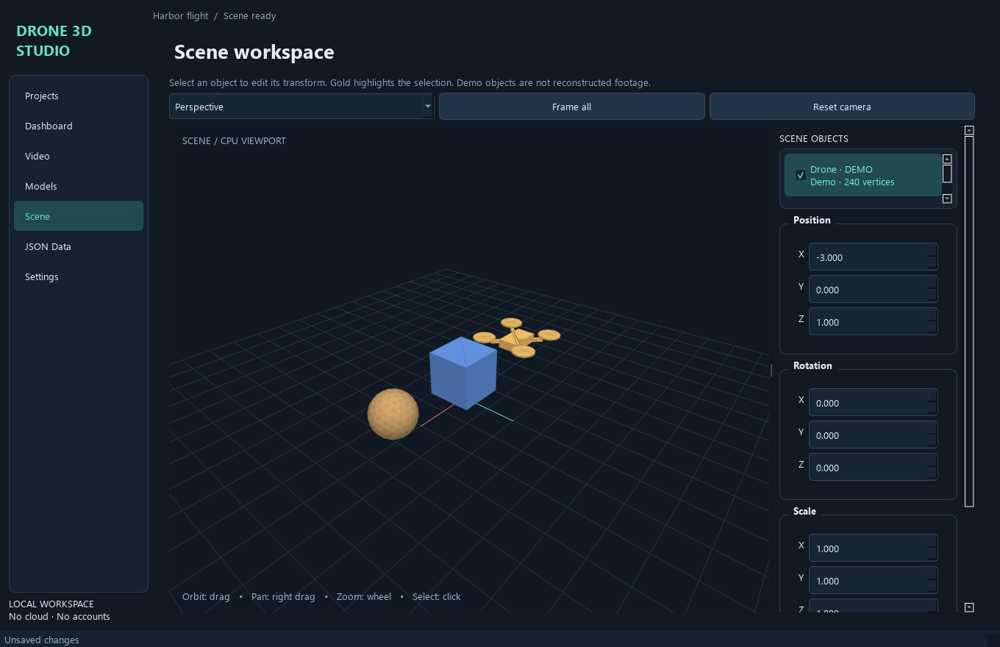
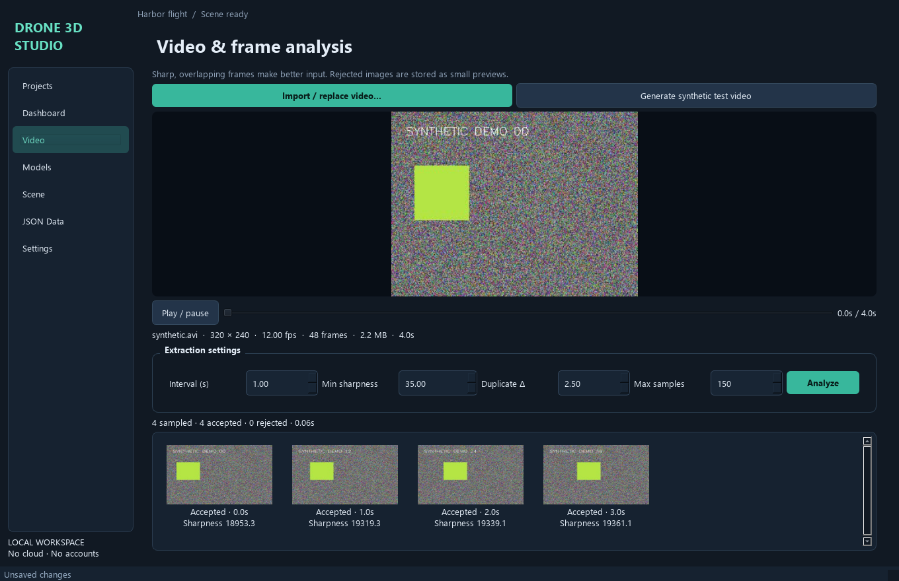
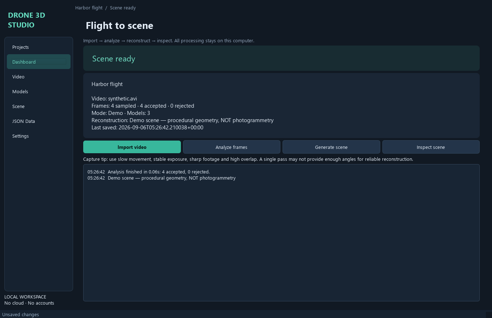

# Drone 3D Studio

A locally runnable Windows desktop MVP for turning drone video into inspected frames and reconstructed 3D scenes. Built with Python, PySide6, OpenCV, NumPy, Pydantic and Trimesh. No accounts, cloud services or API keys. Sparse reconstruction and optional AI depth fusion run on CPU; COLMAP dense stereo requires a CUDA GPU.

**New: [seven-stage setup and download guide](docs/PIPELINE_SETUP.md)** — adaptive sampling, frame quality, GPS keyframes, COLMAP SfM, local Depth Anything V2, verified ENU alignment and colored depth fusion. Includes exact settings, telemetry CSV requirements, actual validation results and limitations of the user's stock clip.

## Demo versus real reconstruction

**Demo mode creates procedural geometry. It does not recover the scene in your footage.** Import a video, run real frame analysis, then generate a clearly labelled drone, box and sphere to try editing, saving and reopening a scene.

**The main reconstruction action always runs real COLMAP.** It runs feature extraction, sequential matching and sparse mapping. With **COLMAP stereo** and **Dense mesh (CUDA)** selected, it also runs image undistortion, PatchMatch stereo, depth fusion and Poisson meshing. A simplified, colored inspection surface opens in the viewer; full-resolution `mesh.ply` and dense `fused.ply` remain in the project reconstruction directory. **Sparse cloud (CPU)** stops after sparse mapping. Alternatively, **Depth Anything V2** generates calibrated, multi-view-filtered colored point clouds. Optional GPS alignment requires synchronized flight telemetry. Texture atlases remain outside this MVP. Demo generation is an explicit, separate test action on the Models page and is never used as a fallback for failed reconstruction.

## Windows installation

Install 64-bit Python 3.12 from [python.org](https://www.python.org/downloads/windows/), including the Python launcher. Python 3.11 is also supported by the declared dependencies. Python 3.10 compatibility is retained; Python 3.14 is excluded from this pinned environment.

From the repository folder in Command Prompt:

```cmd
scripts\setup_windows.cmd
venv\Scripts\activate
python main.py
```

The setup script creates a virtual environment, installs runtime and test requirements, and stops with a nonzero exit code on an error. Manual setup:

```cmd
py -3.12 -m venv venv
venv\Scripts\activate
python -m pip install --upgrade pip
pip install -r requirements.txt
python main.py
```

The primary launch command is **`python main.py`**. In PowerShell, activate with `venv\Scripts\Activate.ps1`; if your execution policy blocks activation, run `venv\Scripts\python main.py` directly.

## Try the full workflow

1. In **Projects**, choose **New project**, enter a name and description, then choose the parent directory. A new project subdirectory is created; an existing directory is never overwritten.
2. In **Video**, import an MP4, MOV or AVI. Choose **No** in the copy prompt to reference the original video; choose **Yes** to copy it into the project. Replacing a video requires confirmation and resets its analysis records while retaining existing scene objects.
3. Play/pause or scrub the silent preview. Review resolution, frame rate, count, duration and file size.
4. Set extraction interval, minimum sharpness, duplicate threshold and maximum samples. Click **Analyze**. The work runs in a cancellable background thread. Accepted/rejected previews show scores and reasons.
5. In Settings choose the extracted COLMAP `bin/colmap.exe`, choose **Dense mesh (CUDA)** or **Sparse cloud (CPU)**, and save settings. Then click **Generate scene**. Models can also import existing geometry. **Generate demo (test only)** is a separate action for procedural test content.
6. In **Scene**, drag to orbit, right/middle-drag to pan, use the wheel to zoom, and click geometry or an object in the hierarchy to select it. Gold indicates selection. Use the named camera views or **Frame all**.
7. Edit position, rotation (degrees) and positive scale in the property panel. Uniform scale sets all three axes to the edited value. Arrow keys move XY by 0.1 units, PageUp/PageDown move Z. Changes appear immediately and trigger autosave. Scroll the property panel on smaller screens.
8. Press **Ctrl+S** or **Save now**. Check the bottom status bar for Saving, Saved or Save failed.
9. Close and reopen **project.drone3d.json**, or double-click its recent-project entry. Models, visibility, transforms, video, frames and settings are restored. Missing assets stay listed with an explanatory status.

Projects can be renamed, duplicated and deleted. Deletion requires confirmation naming the entire directory, including any source videos copied into it. External videos and external model files are never deleted. Model removal only removes its scene record.

## Sample content

Use **Open sample scene** to generate a fresh sample project in a folder you choose, or open `data/samples/Harbor-Demo/project.drone3d.json`. The included lightweight PLY models and JSON are portable and contain no video.

Use **Generate synthetic test video** on the Video page for a small four-second clip. This is explicitly synthetic and is suitable for testing the app, not evaluating photogrammetry. You can also generate content from the command line:

```cmd
python scripts\make_test_video.py output\synthetic.avi
python scripts\make_sample.py output\SampleProject
```

To test with real drone footage, supply your own local video through the file picker. No large video is committed.

## Features

- Persistent sidebar: Projects, Dashboard, Video, Models, Scene, JSON Data and Settings.
- Dark/light theme, validated settings, recent projects and debounced autosave with manual save.
- Versioned JSON, atomic replacement, previous-valid-file backup and recovery prompt.
- Adaptive optical-flow sampling, variance-of-Laplacian sharpness, ORB feature counts, exposure clipping, quality scores and grayscale thumbnail similarity. Optional GPS spacing filters keyframes; fixed sampling remains available. Duplicate scores are mean absolute pixel differences from the last accepted frame; smaller means more similar.
- Full-resolution accepted JPEGs, bounded 240-pixel previews, rejected previews, frame records and per-run analysis report with elapsed time.
- Model import, rename, visibility, removal, vertex/face counts, procedural demo models and per-object transforms.
- Qt software 3D viewer with shaded triangles, point clouds, selection, grid, RGB axes, orbit/pan/zoom and named views.
- JSON refresh, copy, export and validated import with field errors. Importing replaces the current records after confirmation; it does not copy assets.
- Cancellable jobs, process output/exit-code capture, friendly errors and rotating developer logs.

## Optional COLMAP setup

1. Download a Windows binary distribution from the [official COLMAP releases](https://github.com/colmap/colmap/releases). Extract the entire distribution, keeping its supporting DLLs beside the executable as required by that distribution.
2. In **Settings**, choose the actual `colmap.exe` and save. Do not select a `.bat` or `.cmd` wrapper. Alternatively, place it on PATH or set `COLMAP_EXECUTABLE`. The app also checks common Downloads extraction folders. **Check COLMAP installation** executes its help command in a background worker and reports the version. The child process receives COLMAP's own DLL/plugin paths without changing global Windows environment variables.
3. Choose **Dense mesh (CUDA)** for a surface, or **Sparse cloud (CPU)** for CPU-only processing, and save settings. Analyze footage to produce at least three accepted frames; useful results usually require many more sharp, overlapping views. Dense mesh and inspection simplification target COLMAP 4.2.0.
4. Click **Generate scene**. Follow the live Dashboard log or `<project>/logs/colmap.log`. Progress is indeterminate during external commands because COLMAP does not provide a reliable total percentage.
5. On success, reconstructed surfaces or sparse components become editable objects. Dense mode hides the sparse cloud when its surface is available. On failure, the UI records Failed and the detailed exit/log information. Completed intermediate files remain available through **Models → Reconstruction files**; a failed dense stage never claims a successful mesh. Cancellation terminates the active process and retains any previously completed scene.

The backend checks installed help text to select old `SiftExtraction/SiftMatching` or newer `FeatureExtraction/FeatureMatching` GPU option names. Feature extraction/matching use CPU; dense stereo uses CUDA. Extraction is capped at 1600 pixels/four threads; dense images at 1000 pixels, caches at 1 GB, fusion/meshing at four threads and Poisson depth at nine. The surface is simplified to about 1600 faces for the CPU viewer while retaining the original. Another backend can implement the protocol in `reconstruction/colmap.py` without adding subprocess code to the UI.

For repeatable diagnostics without the GUI:

```cmd
python scripts\reconstruct_video.py "D:\path\flight.mp4" output\MyFlight --colmap "D:\path\COLMAP\bin\colmap.exe" --interval 0.5 --max-frames 30
```

The destination must be a new directory. Add `--sparse` for CPU-only output. Open the resulting `project.drone3d.json` in the app. Ctrl+C requests cancellation; logs and status are saved even on failure.

Capture slow movement, stable exposure, sharp images and high overlap. Include viewpoint variation around the subject. A single forward pass, featureless water, moving vegetation or motion blur can prevent registration or reliable depth calibration. Results have arbitrary units unless GPS alignment succeeds; alignment alone does not establish survey accuracy.

## Persistence and portable projects

```text
MyDroneProject/
├── project.drone3d.json
├── backups/project.drone3d.json
├── source/video_reference.json
├── frames/
│   ├── accepted/<run>/
│   ├── rejected/<run>/
│   └── analysis-<run>.json
├── models/
├── reconstruction/<run>/
├── thumbnails/<run>/
├── logs/colmap.log
└── exports/
```

Paths inside the project directory are relative. External references are absolute so their location remains unambiguous. Move the whole project directory to move its included assets. External videos, GLTF buffers and imported source files must remain available or be reimported. JSON export rebases paths relative to the export location; JSON alone is not an asset bundle.

Each save validates data, writes and flushes a temporary file in the destination directory, then replaces the JSON atomically. The previous valid file is kept in `backups`. Corrupt input cannot replace a valid backup. An interrupted running job reopens as Cancelled. Only one application instance should edit a project at a time; cross-process locking is not implemented.

Autosave settings are per project. Settings → Save settings also updates defaults for new projects, including extraction controls on the Video page. Recent projects and app defaults use Qt local preferences; these are not committed.

## Architecture and source structure

```text
drone-3d-studio/
├── main.py
├── src/drone3d_studio/
│   ├── __init__.py
│   ├── application.py          # Qt pages and workflow coordination
│   ├── domain/models.py        # Validated schema, transforms and settings
│   ├── persistence/
│   │   ├── store.py            # Atomic saves, backups, portable references
│   │   └── autosave.py         # Debounced QTimer controller
│   ├── services/
│   │   ├── video.py            # Metadata, streamed sampling, quality checks
│   │   ├── meshes.py           # Model loading and procedural geometry
│   │   ├── telemetry.py        # GPS CSV validation and interpolation
│   │   └── samples.py          # Portable sample project factory
│   ├── reconstruction/
│   │   ├── colmap.py           # Real sparse/dense backend, run reports
│   │   ├── geometry.py         # COLMAP cameras, poses and points
│   │   ├── alignment.py        # Verified GPS-to-ENU alignment
│   │   └── ai_depth.py         # Local inference, calibration and fusion
│   ├── viewer/canvas.py        # CPU Qt 3D projection, drawing and picking
│   └── workers/jobs.py         # Cancellable QThread jobs
├── tests/
│   ├── conftest.py
│   ├── test_storage.py
│   ├── test_services.py
│   ├── test_pipeline.py
│   └── test_gui.py
├── config/sample-settings.json
├── data/samples/Harbor-Demo/    # Sample JSON and small generated PLYs
├── docs/
│   ├── screenshots/            # Actual offscreen app captures
│   ├── PIPELINE_SETUP.md        # Seven-stage settings/downloads/telemetry
│   └── VALIDATION.md           # Commands and observed results
├── scripts/
│   ├── setup_windows.cmd
│   ├── setup_ai_windows.cmd
│   ├── download_depth_model.py
│   ├── refine_with_ai.py
│   ├── build_windows.cmd
│   ├── make_sample.py
│   ├── make_test_video.py
│   ├── reconstruct_video.py
│   └── capture_screenshots.py
├── requirements.txt
├── requirements-dev.txt
├── requirements-ai.txt
├── pyproject.toml
├── .gitignore
├── AGENTS.md
├── LICENSE
└── README.md
```

The UI owns project state. Background services return data through Qt signals; runtime geometry lives in a separate cache and never enters JSON. The viewer uses Qt's painter and NumPy instead of an OpenGL/VTK stack to make its basic operation independent of GPU drivers.

## Tests and startup check

```cmd
pip install -r requirements-dev.txt
pytest
python main.py --smoke-test
```

Tests use Qt's offscreen platform and temporary projects/preferences. They cover atomic saves/failure recovery, schema validation, relative paths, backups, JSON round trips, video analysis and cancellation, model loading, transforms, autosave and a complete GUI workflow. The smoke test initializes, renders and closes the app without a visible window. See [validation results](docs/VALIDATION.md) for the commands actually executed in development.

Optional executable packaging:

```cmd
scripts\build_windows.cmd
```

This installs PyInstaller and builds a directory distribution in `dist/Drone3DStudio`. Packaging is a convenience script and has not been validated as a shipped executable. The source launcher is the supported MVP path.

## Screenshots

Actual app captures using generated synthetic input and a procedural demo scene:





Regenerate with `python scripts\capture_screenshots.py`. The script uses temporary data and closes its offscreen window.

## Supported formats and limits

- Video: MP4, MOV, AVI and MKV when the installed OpenCV/FFmpeg backend can decode the stream. Extensions alone do not guarantee codec support. Playback is silent and approximate for variable-frame-rate files.
- Geometry: OBJ, STL, PLY, GLB and GLTF through Trimesh. GLTF external buffers must remain beside their JSON file. Scenes are flattened while preserving their node transforms. Textures/material fidelity and animation are not displayed.
- The CPU viewer samples imported geometry at most 1,800 triangles or 6,000 points per object. Generated dense surfaces receive a coherent simplified inspection mesh instead of arbitrary triangle sampling, with full-resolution output retained on disk. Vertex colors are displayed; texture atlases are not. Importing a very large model still needs enough RAM for that model.
- This is an object-level editor, not a CAD/mesh topology editor. Transforms are saved in project JSON and are not baked into the original mesh. Undo/redo and transformed mesh export are future work.
- Video analysis samples from the beginning at the configured interval until the maximum sample count. Increase the interval to cover long videos within the cap. It compares only against the last accepted frame; it is not optical-flow overlap estimation.
- Cancelled analysis may leave run-specific frame files on disk, but does not replace completed frame records. Old analysis runs are retained; remove unused files manually only after checking references.
- Model decoding and individual video decoding calls cannot be interrupted midway. Close requests wait for the current call to return, then finish cancellation safely. Huge project duplication runs synchronously and may take time.
- Light theme uses Qt's standard Fusion styling; the screenshot theme is Dark. Recommended window size is 1360 × 880 or larger.

## Troubleshooting

**Python or dependency install fails:** use 64-bit Python 3.12, activate the correct environment, upgrade pip and retry. Keep the setup error output. `python -m pip check` reports dependency conflicts.

**Video is missing or unsupported:** use Import/replace to relink it, or convert it to a commonly supported H.264 MP4. Keep the original file. The app cannot supply missing codec support.

**Every frame is rejected:** lower the sharpness threshold, reduce the duplicate threshold, increase the sampling interval, or capture clearer footage. Defaults are starting points, not universal quality thresholds.

**Model unavailable after moving a project:** external files were referenced rather than copied. Reimport the file from its new location. Missing objects remain listed with the error.

**Save failed:** check write permissions and free space. The status bar retains the failure; dirty state remains pending and the app prevents closing/switching until a save succeeds. Restore the backup through the open-project recovery prompt if the primary JSON is corrupt.

**COLMAP exits immediately:** choose the actual executable, keep its distribution's DLLs intact, and inspect project `logs/colmap.log`. Some distributions require Visual C++ runtime installation. Real output is not guaranteed even when the executable runs.

**Unexpected errors:** the application writes rotating logs under the Qt local application-data directory in `Drone3DStudio/logs/application.log`. Detailed tracebacks go there; dialogs provide readable feedback. COLMAP's full output is logged in the project.

## Dependency references

Exact runtime pins were chosen after checking the official [Qt for Python installation guide](https://doc.qt.io/qtforpython-6/gettingstarted.html), [OpenCV VideoCapture reference](https://docs.opencv.org/4.13.0/d8/dfe/classcv_1_1VideoCapture.html), [Trimesh API](https://trimesh.org/trimesh.html), [Pydantic models documentation](https://docs.pydantic.dev/latest/concepts/models/) and maintainer-published package versions on PyPI. These are tested pins, not a claim that every package is the newest release. The [COLMAP CLI documentation](https://github.com/colmap/colmap/blob/main/doc/cli.rst) informs the optional CPU backend.

## Roadmap

Future work: a GPU-accelerated optional viewport, texture atlases, additional reconstruction backends, overlap estimation, undo/redo, transformed model export, portable project bundles and more telemetry formats.
